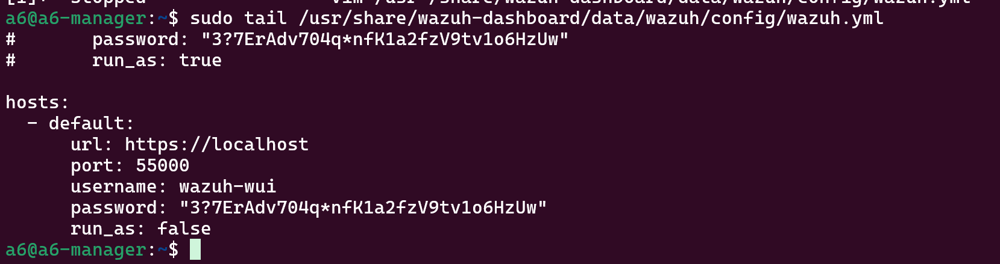
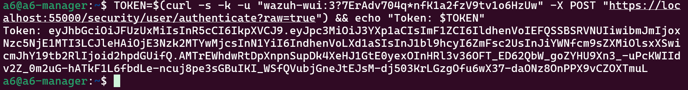

# SIEM-SOAR Project
## Wazuh SIEM + Shuffle SOAR: DDoS Detection & Automated Response


**Mata Kuliah:** Manajemen Insiden Keamanan Siber  
**Institut:** Institut Teknologi Sepuluh Nopember (ITS)  
**Kelompok:** 10  

| Nama | NRP |
|------|-----|
| Rayka Dharma Pranandita | 5027241039 |
| M. Hikari Reiziq R | 5027241079 |
| M. Faqih Ridho | 5027241123 |

---

## 📋 Daftar Isi

- [Deskripsi Project](#-deskripsi-project)
- [Arsitektur Sistem](#-arsitektur-sistem)
- [Infrastruktur Azure](#-infrastruktur-azure)
- [Bagian 1: Setup Wazuh SIEM](#-bagian-1-setup-wazuh-siem)
- [Bagian 2: Wazuh Engineer - Setup API](#-bagian-2-wazuh-engineer---setup-api)
- [Bagian 3: Setup Shuffle SOAR](#-bagian-3-setup-shuffle-soar)
- [Bagian 4: Integrasi Wazuh → Shuffle](#-bagian-4-integrasi-wazuh--shuffle)
- [Bagian 5: Demo & Hasil](#-bagian-5-demo--hasil)
- [Referensi](#-referensi)

---

## 📖 Deskripsi Project

Project ini mengimplementasikan arsitektur **SIEM (Security Information and Event Management)** menggunakan **Wazuh** yang diintegrasikan dengan **SOAR (Security Orchestration, Automation and Response)** menggunakan **Shuffle** untuk mendeteksi dan merespons serangan **DDoS SYN Flood** secara otomatis di platform **Microsoft Azure**.

### Alur Sistem
```
hping3 SYN Flood (Agent2)
        ↓
iptables logging → kern.log (Agent1)
        ↓
Wazuh rule 100010 → 100011 trigger (level 12)
        ↓
Wazuh kirim alert JSON → Shuffle Webhook
        ↓
Shuffle: Get-Wazuh-Token → Block-Attacker-IP
        ↓
IP Penyerang di-DROP di SEMUA Agent (Global Block)
```

---

## 🏗️ Arsitektur Sistem

```
┌─────────────────────────────────────────────────────────┐
│                    Azure Cloud (East Asia)               │
│                                                          │
│  ┌─────────────┐    SYN Flood    ┌─────────────────┐    │
│  │  a6-agent2  │ ─────────────► │    a6-agent      │    │
│  │  (Attacker) │                │  (Korban/Target) │    │
│  │  10.0.0.6   │                │    10.0.0.5      │    │
│  └─────────────┘                └────────┬────────┘    │
│                                          │ kern.log     │
│                                          ▼              │
│                                 ┌─────────────────┐     │
│                                 │   a6-manager    │     │
│                                 │  Wazuh Manager  │     │
│                                 │   10.0.0.4      │     │
│                                 └────────┬────────┘     │
│                                          │ Webhook       │
└──────────────────────────────────────────┼──────────────┘
                                           │
                                           ▼
                                  ┌─────────────────┐
                                  │  Shuffle Cloud   │
                                  │  (shuffler.io)   │
                                  │                  │
                                  │ Get-Wazuh-Token  │
                                  │        ↓         │
                                  │ Block-Attacker-IP│
                                  └─────────────────┘
```

---

## ☁️ Infrastruktur Azure

| VM | Public IP | Private IP | Peran | Size | OS |
|---|---|---|---|---|---|
| a6-manager | 104.214.169.40 | 10.0.0.4 | Wazuh Manager | Standard B2als v2 | Ubuntu 24.04 LTS |
| a6-agent | 104.214.177.46 | 10.0.0.5 | Korban/Target | Standard B2ats v2 | Ubuntu 24.04 LTS |
| a6-agent2 | 20.187.147.134 | 10.0.0.6 | Penyerang | Standard B2ats v2 | Ubuntu 24.04 LTS |

### NSG Rules yang Dibuka

| Rule | Port | Protokol | Fungsi |
|---|---|---|---|
| AgentComm | 1514 | TCP | Komunikasi Agent ke Manager |
| Enrollment | 1515 | TCP | Pendaftaran agent baru |
| Dashboard | 443 | TCP | Akses Wazuh Dashboard (HTTPS) |
| API | 55000 | TCP | Wazuh REST API (untuk Shuffle) |

---

## 🛡️ Bagian 1: Setup Wazuh SIEM

### Instalasi Wazuh Manager (All-in-One)

```bash
curl -sO https://packages.wazuh.com/4.7/wazuh-install.sh && \
sudo bash wazuh-install.sh -a -i
```

### Konfigurasi iptables di Agent-1

Tambahkan rule iptables untuk logging SYN packet:

```bash
sudo iptables -A INPUT -p tcp --dport 80 --syn \
  -m limit --limit 50/s \
  -j LOG --log-prefix "Wazuh-DDoS-Alert "
```

### Custom Rules di Manager

File: `/var/ossec/etc/rules/local_rules.xml`

```xml
<group name="ddos_poc,attack,">

  <!-- Step 1: Deteksi setiap SYN packet yang dicatat iptables -->
  <rule id="100010" level="3">
    <if_sid>4100</if_sid>
    <match>Wazuh-DDoS-Alert</match>
    <description>Iptables: Incoming SYN packet detected on port 80.</description>
    <group>network_traffic,</group>
  </rule>

  <!-- Step 2: Trigger DDoS alert jika 100+ paket dalam 10 detik -->
  <rule id="100011" level="12" frequency="100" timeframe="10">
    <if_matched_sid>100010</if_matched_sid>
    <description>CRITICAL ALERT: DDoS SYN Flood Attack Detected! High frequency of SYN packets.</description>
    <group>ddos_attack,pci_dss_11.4,</group>
  </rule>

</group>
```

### Active Response & Integrasi di ossec.conf Manager

```xml
<!-- Active Response: Blokir IP penyerang selama 60 detik -->
<active-response>
  <command>firewall-drop</command>
  <location>local</location>
  <rules_id>100011</rules_id>
  <timeout>60</timeout>
</active-response>

<!-- Integrasi ke Shuffle SOAR -->
<integration>
  <name>shuffle</name>
  <hook_url>https://shuffler.io/api/v1/hooks/webhook_c99cc04a-5318-452d-844b-17b81f291215</hook_url>
  <rule_id>100011</rule_id>
  <alert_format>json</alert_format>
</integration>
```

---

## 🔑 Bagian 2: Wazuh Engineer - Setup API

> **Referensi:**
> - [Cara cek password wazuh-wui](https://www.youtube.com/watch?v=hvxExNLqRK4)
> - [Dokumentasi Wazuh API](https://documentation.wazuh.com/current/user-manual/api/index.html)

### STEP 1 — Temukan Password wazuh-wui

SSH ke manager, lalu jalankan:

```bash
sudo tail /usr/share/wazuh-dashboard/data/wazuh/config/wazuh.yml
```



Output yang didapat:
```
hosts:
  - default:
      url: https://localhost
      port: 55000
      username: wazuh-wui
      password: "3?7ErAdv704q*nfK1a2fzV9tv1o6HzUw"
      run_as: false
```

### STEP 2 — Dapatkan Token JWT

Gunakan password dari Step 1 untuk mendapatkan token:

```bash
TOKEN=$(curl -s -k -u "wazuh-wui:3?7ErAdv704q*nfK1a2fzV9tv1o6HzUw" \
  -X POST \
  "https://localhost:55000/security/user/authenticate?raw=true") \
  && echo "Token: $TOKEN"
```



> ✅ Jika token panjang muncul, berarti Wazuh API berfungsi dengan baik.

### STEP 3 — Test List Agents

Verifikasi semua agent terdaftar:

```bash
curl -s -k -X GET "https://localhost:55000/agents?pretty=true" \
  -H "Authorization: Bearer $TOKEN" \
  | python3 -m json.tool | grep -E "name|status|ip"
```


Output yang diharapkan:
```
"name": "a6-manager", "status": "active"
"name": "a6-agent2",  "status": "active", "ip": "10.0.0.6"
"name": "Agent-1",    "status": "active", "ip": "10.0.0.5"
```

### STEP 4 — Buat User shuffle-user di Wazuh API

```bash
curl -s -k -X POST "https://localhost:55000/security/users" \
  -H "Authorization: Bearer $TOKEN" \
  -H "Content-Type: application/json" \
  -d '{"username":"shuffle-user","password":"Shuffle@Wazuh2026!"}' \
  | python3 -m json.tool
```


> ✅ Catat nomor `id` yang muncul — dalam kasus ini **id: 100**

### STEP 5 — Assign Role Administrator ke shuffle-user

Gunakan `id` dari Step 4 (dalam contoh ini id=100):

```bash
curl -s -k -X POST \
  "https://localhost:55000/security/users/100/roles?role_ids=1" \
  -H "Authorization: Bearer $TOKEN" \
  | python3 -m json.tool
```


Output yang diharapkan:
```json
{
  "message": "All roles were linked to user shuffle-user",
  "error": 0
}
```

### STEP 6 — Test Login sebagai shuffle-user

```bash
TOKEN2=$(curl -s -k -u "shuffle-user:Shuffle@Wazuh2026!" \
  -X POST \
  "https://localhost:55000/security/user/authenticate?raw=true") \
  && echo "Token shuffle-user: $TOKEN2"
```


> ✅ Jika token muncul, user shuffle-user siap digunakan oleh Shuffle SOAR.

**Kredensial final shuffle-user:**

| Field | Value |
|---|---|
| Username | `shuffle-user` |
| Password | `Shuffle@Wazuh2026!` |
| User ID | `100` |
| Role | Administrator (role_id: 1) |
| API Port | `55000` |

---

## 🔄 Bagian 3: Setup Shuffle SOAR

### Kenapa Shuffle Cloud?

Shuffle lokal tidak bisa diinstall di a6-manager karena RAM sudah penuh (3.4GB/3.8GB terpakai Wazuh-indexer). Solusi: menggunakan **Shuffle Cloud (shuffler.io)** yang gratis dan tidak memerlukan instalasi.

### Buat Workflow di Shuffle

1. Buka [shuffler.io](https://shuffler.io) → Login
2. Klik **"+ Create Workflow"**
3. Nama: `Wazuh DDoS Response`
4. Tambahkan 3 node:

### Node 1 — Webhook (Trigger)

- Drag **Webhook** dari panel kiri ke kanvas
- Klik **"Start"** untuk mengaktifkan
- Copy **Webhook URI** yang muncul

### Node 2 — Get-Wazuh-Token

| Field | Value |
|---|---|
| App | HTTP |
| Action | POST |
| URL | `https://104.214.169.40:55000/security/user/authenticate?raw=true` |
| Headers | `Content-Type: application/json` |
| Username | `shuffle-user` |
| Password | `Shuffle@Wazuh2026!` |
| Verify | False |

### Node 3 — Block-Attacker-IP

| Field | Value |
|---|---|
| App | HTTP |
| Action | **PUT** |
| URL | `https://104.214.169.40:55000/active-response` |
| Headers | `Authorization: Bearer $Get-Wazuh-Token.body` + newline + `Content-Type: application/json` |
| Verify | False |

Body:
```json
{
  "command": "firewall-drop",
  "arguments": ["-", "null", "$exec.all_fields.data.srcip", "NULL"],
  "alert": {
    "data": {
      "srcip": "$exec.all_fields.data.srcip"
    }
  }
}
```

### Alur Final Workflow

```
Webhook 1 ──► Get-Wazuh-Token ──► Block-Attacker-IP
```

---

## 🔗 Bagian 4: Integrasi Wazuh → Shuffle

### Tambahkan Integrasi di ossec.conf

SSH ke manager:

```bash
sudo nano /var/ossec/etc/ossec.conf
```

Tambahkan sebelum `</ossec_config>`:

```xml
<integration>
  <name>shuffle</name>
  <hook_url>https://shuffler.io/api/v1/hooks/webhook_c99cc04a-5318-452d-844b-17b81f291215</hook_url>
  <rule_id>100011</rule_id>
  <alert_format>json</alert_format>
</integration>
```

Restart manager:

```bash
sudo systemctl restart wazuh-manager
sudo systemctl status wazuh-manager | grep Active
```

### Monitor Log Integrasi

```bash
sudo tail -f /var/ossec/logs/integrations.log
```

Output saat berhasil:
```
/tmp/shuffle-XXXXX.alert  https://shuffler.io/api/v1/hooks/webhook_c99cc04a-...
```

---

## 🎯 Bagian 5: Demo & Hasil

### Skenario Serangan DDoS

**Terminal 1 — agent2 (attacker):**
```bash
sudo hping3 -S -p 80 -c 3000 -i u2000 10.0.0.5
```

**Terminal 2 — agent1 (korban), monitor iptables:**
```bash
watch -n 2 'sudo iptables -L INPUT -n | grep 10.0.0.6'
```

**Terminal 3 — manager, monitor log:**
```bash
sudo tail -f /var/ossec/logs/integrations.log
```

### Hasil yang Dicapai ✅

| Komponen | Status | Bukti |
|---|---|---|
| hping3 SYN Flood | ✅ | 3000 SYN packets terkirim |
| iptables logging | ✅ | Log "Wazuh-DDoS-Alert" di kern.log |
| Wazuh rule 100011 | ✅ | 73 alert level 12 di dashboard |
| Integrasi ke Shuffle | ✅ | Multiple workflow runs masuk |
| Get-Wazuh-Token | ✅ | Status 200, token JWT didapat |
| Block-Attacker-IP | ✅ | Status 200, affected_items: [001, 002] |
| Global IP Block | ✅ | "AR command was sent to all agents" |

### Response dari Wazuh API saat Block

```json
{
  "data": {
    "affected_items": ["001", "002"],
    "total_affected_items": 2,
    "total_failed_items": 0,
    "failed_items": []
  },
  "message": "AR command was sent to all agents",
  "error": 0
}
```

> 🎉 IP penyerang `10.0.0.6` berhasil diblokir di **semua agent** secara global dalam hitungan detik setelah serangan terdeteksi. Blokir berlaku selama **60 detik** kemudian otomatis dihapus.

### Payload Alert dari Wazuh ke Shuffle

```json
{
  "severity": 3,
  "title": "CRITICAL ALERT: DDoS SYN Flood Attack Detected! High frequency of SYN packets.",
  "rule_id": "100011",
  "text": "2026-05-24T14:07:14 a6-agent kernel: Wazuh-DDoS-Alert: IN=eth0 OUT= MAC=70:a8:a5:04:57:...",
  "timestamp": "2026-05-24T14:07:16.257+0000"
}
```

---

## 📚 Referensi

- [Dokumentasi Wazuh API](https://documentation.wazuh.com/current/user-manual/api/index.html)
- [Cara cek password wazuh-wui](https://www.youtube.com/watch?v=hvxExNLqRK4)
- [Shuffle SOAR Documentation](https://shuffler.io/docs/about)
- [Shuffle Install Guide](https://github.com/Shuffle/Shuffle/blob/main/.github/install-guide.md)
- [Percakapan Claude - Setup Guide](https://claude.ai/share/6f867439-a0e5-47a8-8c6f-656d21dcc85f)

---

## 📁 Struktur Repository

```
SIEM-SOAR-Project/
│   README.md
│
└───Image/
        Step1_WazzuhAPI.png
        Step2_WazzuhToken.png
        step3_Test List Agents.png
        step4_Buat User shuffle-user.png
        step5_Assign Role Administrator ke shuffle-user.png
        step6_Test Login sebagai shuffle-user.png
```

---

<div align="center">
  <p>Made with ❤️ by Kelompok 10 - ITS 2026</p>
  <p>Manajemen Insiden Keamanan Siber</p>
</div>
```

---
