# 🛡️ SIEM-SOAR Project: Next-Generation SOC Architecture

## Human-AI Collaboration Model for False Positive Reduction


**Mata Kuliah:** Manajemen Insiden Keamanan Siber (SOC) — Genap 2024/2025  
**Institut:** Institut Teknologi Sepuluh Nopember (ITS)  
**Kelompok:** 10  

| Anggota | NRP | Pembagian Tugas |
|---------|-----|------------------|
| Arya Bisma Putra Refman | 5027241036 | Shuffle Automation Setup, DDoS Setup, and ML |
| M. Hikari Reiziq Rakhmadinta | 5027241079 | SOAR and Shuffle Automation Setup and Documentation |
| M. Faqih Ridho | 5027241123 | Shuffle Automation Setup, Simulasi Serangan |
| Rayka Dharma Pranandita | 5027241039 | Setup VM, Shuffle Automation Setup, Alerting, Email Phishing Setup |
| Muhammad Ziddan Habibi | 5027241122 | ML, Simulasi Serangan, Setup VM AI |
| Mochammad Atha Tajuddin | 5027241093 | Malware Setup, Custom Rules, and Active Response |

---

<!-- ============================================================ -->
<!-- TAB NAVIGATION -->
<!-- ============================================================ -->

<table>
  <tr>
    <td><a href="README.md"><b>📘 Dokumentasi Terbaru</b> ✅</a></td>
    <td><a href="README_v1.md"><b>📂 Dokumentasi Lama</b></a></td>
  </tr>
</table>

## 📋 Daftar Isi

- [Latar Belakang](#-latar-belakang)
- [Arsitektur Sistem](#-arsitektur-sistem)
- [Infrastruktur Azure](#-infrastruktur-azure)
- [Use Case 1: DDoS Attack Detection](#-use-case-1-ddos-attack-detection--automated-response)
- [Use Case 2: Malware Detection](#-use-case-2-malware-detection-yara--wazuh-syscheck)
- [Use Case 3: Phishing Detection](#-use-case-3-phishing-email-detection--ai-classification)
- [Ringkasan Hasil & Dampak](#-ringkasan-hasil--dampak)
- [Referensi & Dataset](#-referensi--dataset)

---

## 🎯 Latar Belakang

### Permasalahan

Tim Security Operation Center (SOC) di seluruh dunia menghadapi tantangan besar: **banjirnya alert palsu (false positives)**. Filosofi *"Better Safe Than Sorry"* yang diterapkan oleh SIEM tradisional menyebabkan:

- **Alert fatigue** — analis SOC kewalahan dengan ribuan alert per hari, sebagian besar adalah false positive.
- **Burnout** — beban kerja berlebih menyebabkan kelelahan dan penurunan kualitas respons.
- **Missed True Threats** — ironisnya, terlalu banyak alert justru membuat ancaman sesungguhnya terabaikan.

### Solusi: Human-AI Collaboration Model

Project ini mengimplementasikan arsitektur **SOC Generasi Baru** yang menempatkan **model AI custom** di antara SIEM dan SOAR sebagai *intelligent filter*:

```
┌──────────────┐      ┌────────────────┐      ┌──────────────┐
│   SIEM       │      │   AI Engine    │      │    SOAR      │
│  (Wazuh)     │ ───► │  (Custom DL)   │ ───► │  (Shuffle)   │
│              │      │                │      │              │
│ Deteksi      │      │ Klasifikasi    │      │ Response     │
│ Anomali      │      │ True/False     │      │ Otomatis     │
│              │      │ Alarm          │      │              │
└──────────────┘      └────────────────┘      └──────────────┘
```

**Keunggulan arsitektur ini:**
- AI menyaring alert sebelum sampai ke SOAR, sehingga **hanya ancaman valid yang ditindaklanjuti**
- Model AI dikembangkan secara **mandiri (custom-built)**, bukan menggunakan API pihak ketiga
- Respons otomatis dilakukan oleh Shuffle SOAR, termasuk **blokir IP, labeling email, notifikasi Telegram & Notion**

### 3 Vektor Serangan yang Ditangani

| # | Vektor Serangan | Metode Deteksi | AI Model | SOAR Response |
|---|----------------|---------------|----------|--------------|
| 1 | **DDoS (SYN Flood)** | Wazuh + iptables logging | CNN, DNN, GRU, LSTM | Blokir IP + Notifikasi Telegram & Notion |
| 2 | **Malware** | Wazuh Syscheck + YARA Rules | ❌ Tidak menggunakan AI | Alert ke Shuffle via Webhook |
| 3 | **Phishing Email** | Gmail API + Shuffle SOAR | Deep Learning (ONNX) | Labeling Email + Notifikasi Telegram |

---

## 🏗️ Arsitektur Sistem

```
┌──────────────────────────────────────────────────────────────────┐
│                    Azure Cloud (Malaysia West, Zone 1)            │
│                    VNet: SOCAI-vnet/default                       │
│                                                                   │
│  ┌─────────────┐    SYN Flood    ┌──────────────────┐            │
│  │  a6-agent2  │ ─────────────► │    a6-agent       │            │
│  │  (Attacker) │                │  (Korban/Target)  │            │
│  │  10.0.0.6   │                │    10.0.0.5       │            │
│  └─────────────┘                └────────┬─────────┘            │
│                                          │ kern.log / syscheck   │
│                                          ▼                       │
│                                 ┌──────────────────┐             │
│                                 │   a6-manager     │             │
│                                 │  Wazuh Manager   │             │
│                                 │   10.0.0.4       │             │
│                                 │ + AI Model Host  │             │
│                                 │ (Port 8000)      │             │
│                                 └───────┬──────────┘             │
│                                         │ Webhook / API          │
└─────────────────────────────────────────┼────────────────────────┘
                                          │
                          ┌───────────────┼───────────────┐
                          ▼               ▼               ▼
                 ┌──────────────┐ ┌──────────────┐ ┌──────────────┐
                 │ Shuffle SOAR │ │   Telegram   │ │   Notion     │
                 │(shuffler.io) │ │   Bot API    │ │   Database   │
                 └──────────────┘ └──────────────┘ └──────────────┘
```

---

## ☁️ Infrastruktur Azure

Semua VM di-deploy pada **Microsoft Azure for Students** dengan spesifikasi berikut:

| VM | Private IP | Peran | Size | OS |
|---|---|---|---|---|
| a6-manager | 10.0.0.4 | Wazuh Manager + AI Host | Standard D2s v3 (2 vCPU, 8 GiB RAM) | Ubuntu 24.04 LTS |
| a6-agent | 10.0.0.5 | Korban/Target + Wazuh Agent | Standard B2ats v2 | Ubuntu 24.04 LTS |
| a6-agent2 | 10.0.0.6 | Penyerang (Attacker) | Standard B2ats v2 | Ubuntu 24.04 LTS |

### Spesifikasi VM (AI Host)

VM `a6-manager` digunakan untuk hosting model AI Phishing pada port 8000, dengan spesifikasi **Standard D2s v3 (2 vCPU, 8 GiB memory)** di region **Malaysia West (Zone 1)**.

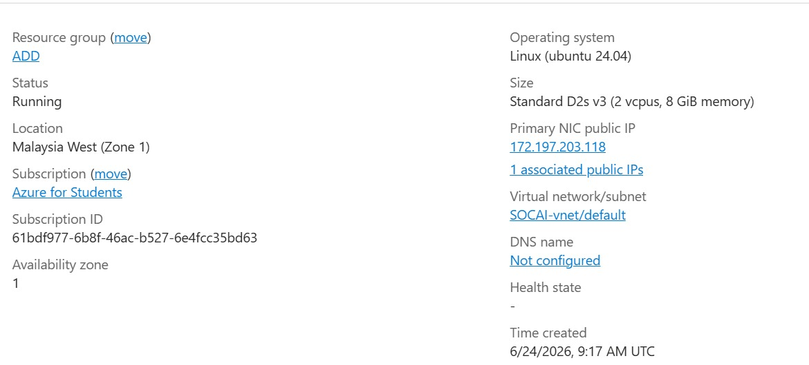

### Network Security Group (NSG)

NSG dikonfigurasi untuk mengizinkan komunikasi antar komponen:

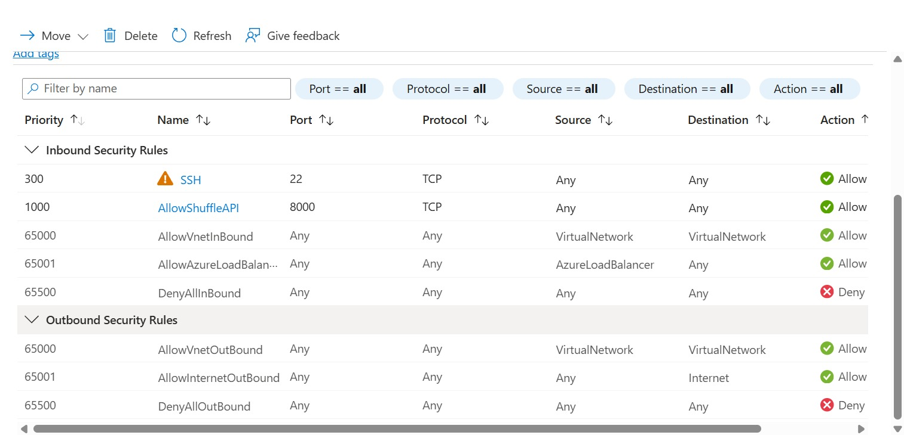

| Rule | Port | Protokol | Fungsi |
|---|---|---|---|
| SSH | 22 | TCP | Remote access ke VM |
| AllowShuffleAPI | 8000 | TCP | Endpoint AI Model (untuk Shuffle → VM) |
| AgentComm | 1514 | TCP | Komunikasi Agent ke Manager |
| Enrollment | 1515 | TCP | Pendaftaran agent baru |
| Dashboard | 443 | TCP | Akses Wazuh Dashboard (HTTPS) |
| API | 55000 | TCP | Wazuh REST API (untuk Shuffle) |

---

## 🔴 Use Case 1: DDoS Attack Detection & Automated Response

### Latar Belakang

Serangan **DDoS SYN Flood** adalah salah satu serangan paling umum yang menargetkan ketersediaan (availability) layanan. Penyerang mengirimkan ribuan paket SYN tanpa menyelesaikan *three-way handshake*, sehingga server kehabisan resource untuk koneksi yang sah. Deteksi dini dan respons otomatis sangat krusial untuk meminimalkan dampak.

### AI Model yang Digunakan

Kami mengembangkan dan melatih **4 arsitektur Deep Learning** untuk mengklasifikasikan trafik jaringan sebagai serangan DDoS atau trafik normal:

| Model | Arsitektur | Format | Ukuran File |
|-------|-----------|--------|-------------|
| **CNN** | Convolutional Neural Network | `.keras` / `.onnx` | 474 KB / 150 KB |
| **DNN** | Deep Neural Network | `.keras` / `.onnx` | 23 KB / 2.4 KB |
| **GRU** | Gated Recurrent Unit | `.keras` / `.onnx` | 75 KB / 33 KB |
| **LSTM** | Long Short-Term Memory | `.keras` / `.onnx` | 87 KB / 35 KB |

- **Dataset:** [DDoS Dataset dari Kaggle](https://www.kaggle.com/code/habibiziddanmuhammad/ddoss) — berisi fitur-fitur trafik jaringan yang telah dilabeli sebagai DDoS atau Benign.
- **Training Notebook:** [`DDOS/ddoss.ipynb`](DDOS/ddoss.ipynb)
- **Format Deploy:** Model diekspor ke format **ONNX** untuk inferensi cepat tanpa dependensi TensorFlow.

### Alur Deteksi & Respons (Pipeline)

```
hping3 SYN Flood (a6-agent2 / Attacker)
        ↓
iptables logging → kern.log (a6-agent / Korban)
        ↓
Wazuh rule 100010 → 100011 trigger (level 12, freq ≥100 dalam 10 detik)
        ↓
Wazuh kirim alert JSON → Shuffle Webhook
        ↓
Shuffle: DDoS-ML-Classify (AI Model) → Validasi ancaman
        ↓ (jika true threat)
┌───────────┬─────────────────┬──────────────────┐
│ Notion DB │ Telegram Alert  │ Block Attacker IP│
│ (Logging) │ (Notifikasi)    │ (Active Response)│
└───────────┴─────────────────┴──────────────────┘
```

### Setup SIEM (Wazuh)

#### Konfigurasi iptables di Agent (Korban)

```bash
sudo iptables -A INPUT -p tcp --dport 80 --syn \
  -m limit --limit 50/s \
  -j LOG --log-prefix "Wazuh-DDoS-Alert "
```

#### Custom Rules di Manager

File: `/var/ossec/etc/rules/local_rules.xml`

```xml
<group name="ddos_poc,attack,">
  <!-- Step 1: Deteksi setiap SYN packet yang dicatat iptables -->
  <rule id="100010" level="3">
    <if_sid>4100</if_sid>
    <match>Wazuh-DDoS-Alert</match>
    <description>Iptables: Incoming SYN packet detected on port 80.</description>
    <group>network_traffic,</group>
  </rule>

  <!-- Step 2: Trigger DDoS alert jika 100+ paket dalam 10 detik -->
  <rule id="100011" level="12" frequency="100" timeframe="10">
    <if_matched_sid>100010</if_matched_sid>
    <description>CRITICAL ALERT: DDoS SYN Flood Attack Detected! High frequency of SYN packets.</description>
    <group>ddos_attack,pci_dss_11.4,</group>
  </rule>
</group>
```

#### Integrasi ke Shuffle SOAR

Ditambahkan di `/var/ossec/etc/ossec.conf`:

```xml
<!-- Active Response: Blokir IP penyerang selama 60 detik -->
<active-response>
  <command>firewall-drop</command>
  <location>local</location>
  <rules_id>100011</rules_id>
  <timeout>60</timeout>
</active-response>

<!-- Integrasi ke Shuffle SOAR -->
<integration>
  <name>shuffle</name>
  <hook_url>https://shuffler.io/api/v1/hooks/webhook_****</hook_url>
  <rule_id>100011</rule_id>
  <alert_format>json</alert_format>
</integration>
```

### Workflow SOAR (Shuffle)

Workflow akhir DDoS terdiri dari 5 node yang berjalan secara berurutan:

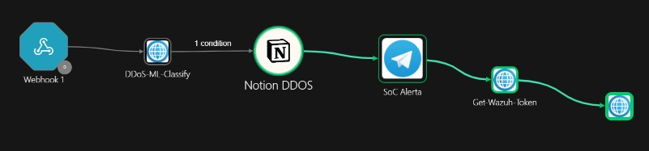

```
Webhook 1 ──► DDoS-ML-Classify (AI) ──► Notion DDOS ──► SoC Alerta (Telegram) ──► Get-Wazuh-Token ──► Block IP
```

**Penjelasan setiap node:**

| # | Node | Fungsi |
|---|------|--------|
| 1 | **Webhook 1** | Menerima alert JSON dari Wazuh saat rule 100011 terpicu |
| 2 | **DDoS-ML-Classify** | Mengirim data ke AI Model untuk klasifikasi (true DDoS vs false alarm), dengan 1 condition untuk filter |
| 3 | **Notion DDOS** | Mencatat insiden ke Notion Database (Kanban Board) |
| 4 | **SoC Alerta** | Mengirim notifikasi ke Telegram Bot |
| 5 | **Get-Wazuh-Token → Block IP** | Autentikasi ke Wazuh API → Eksekusi Active Response `firewall-drop` di semua agent |

### Output & Hasil

#### Notion Kanban Board — DDoS Incidents

Setiap insiden DDoS yang terdeteksi dicatat secara otomatis ke Notion Database dalam format Kanban Board dengan kolom status: **No Status → Open → Investigating → Resolved**.

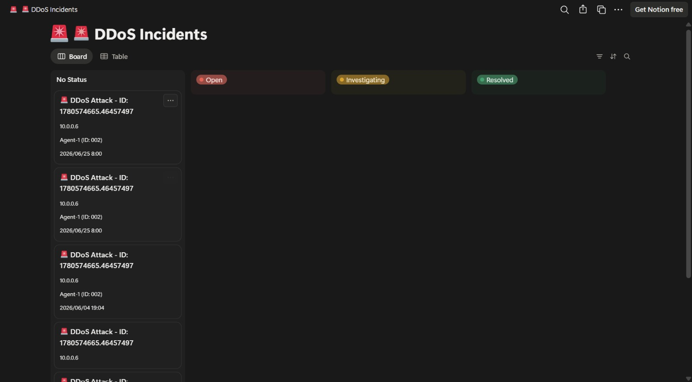

#### Telegram Alert

Notifikasi dikirim ke grup Telegram SOC dengan detail:
- Rule ID & Alert ID
- Victim Agent & IP
- Attacker IP & Protocol
- Mitigation Action yang diambil

#### IP Blocking

IP penyerang (`10.0.0.6`) berhasil diblokir secara **global di semua agent** dalam hitungan detik. Blokir berlaku selama **60 detik** lalu otomatis dihapus (sesuai konfigurasi `timeout`).

---

## 🟢 Use Case 2: Malware Detection (YARA + Wazuh Syscheck)

### Latar Belakang

Malware tetap menjadi ancaman utama bagi keamanan endpoint. Deteksi berbasis **signature** menggunakan **YARA rules** yang diintegrasikan dengan fitur **Syscheck** dari Wazuh memungkinkan deteksi file berbahaya secara realtime ketika file baru dibuat atau dimodifikasi pada direktori yang dimonitor.

> ⚠️ **Catatan:** Use case malware **tidak menggunakan model AI**. Deteksi dilakukan sepenuhnya melalui YARA rules yang dicocokkan oleh Wazuh Syscheck. Pendekatan ini dipilih karena YARA rules sudah sangat efektif untuk deteksi berbasis signature dan memiliki database signature yang luas dari komunitas keamanan siber.

### Setup YARA + Wazuh Syscheck

#### STEP 1 — Install YARA di Manager & Agent

```bash
# Di a6-manager:
sudo apt update && sudo apt install yara -y

# Di a6-agent:
sudo apt update && sudo apt install yara -y
```

Lalu buat direktori dan file YARA rule di agent:

```bash
sudo mkdir -p /var/ossec/etc/shared/yara_rules
sudo nano /var/ossec/etc/shared/yara_rules/malware.yar
```

**Isi YARA Rule (EICAR Test File):**

```yara
rule EICAR_Test_File {
    strings:
        $eicar = "X5O!P%@AP[4\\PZX54(P^)7CC)7}$EICAR-STANDARD-ANTIVIRUS-TEST-FILE!$H+H*"
    condition:
        $eicar
}
```

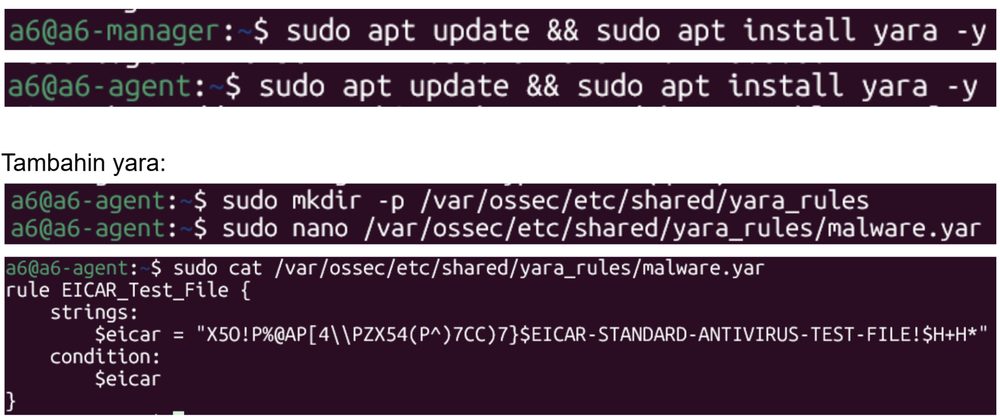

#### STEP 2 — Konfigurasi Syscheck & Custom Rules

**Di agent** (`/var/ossec/etc/ossec.conf`), tambahkan syscheck untuk monitoring direktori:

```xml
<syscheck>
  <directories check_all="yes" realtime="yes">/home/a6/virus</directories>
</syscheck>
```

**Di manager** (`/var/ossec/etc/rules/local_rules.xml`), tambahkan custom rules:

```xml
<group name="malware,yara,">
  <rule id="100020" level="3">
    <decoded_as>yara_local</decoded_as>
    <description>YARA scan log detected.</description>
  </rule>
  <rule id="100021" level="12">
    <if_matched_sid>100020</if_matched_sid>
    <field name="trigger_status">wazuh_yara_trigger</field>
    <description>CRITICAL ALERT: Malware Detected by YARA Scan on host!</description>
    <group>virus,malware_detection,</group>
  </rule>
</group>
```

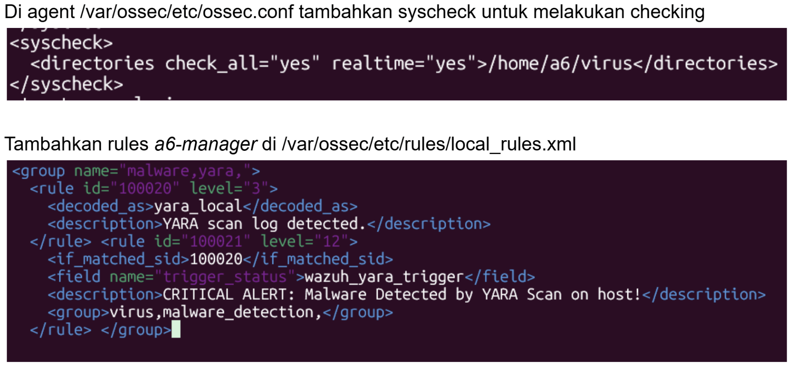

#### STEP 3 — Tambahkan Rule ID ke Integration

Tambahkan rule ID `100021` (bersama rule DDoS `100011`) ke dalam integrasi Shuffle di `/var/ossec/etc/ossec.conf`:

```xml
<integration>
  <name>shuffle</name>
  <hook_url>https://shuffler.io/api/v1/hooks/webhook_****</hook_url>
  <rule_id>100011,100021</rule_id>
  <alert_format>json</alert_format>
</integration>
```


#### STEP 4 — Verifikasi Rule dengan wazuh-logtest

Gunakan `wazuh-logtest` untuk memverifikasi bahwa rule bekerja dengan benar:

```bash
sudo /var/ossec/bin/wazuh-logtest
```

Input test log:
```
2026-06-24T15:00:00 a6-agent yara_scan: wazuh_yara_trigger - File: /home/a6/virus/malware_test.exe - Rule: EICAR_Test_File
```

Hasil yang diharapkan:
- **Phase 1:** Pre-decoding berhasil
- **Phase 2:** Decoding berhasil — `name: yara_local`, `trigger_status: wazuh_yara_trigger`, `yara_rule: EICAR_Test_File`
- **Phase 3:** Rule `100020` (level 3) terpicu → Alert to be generated

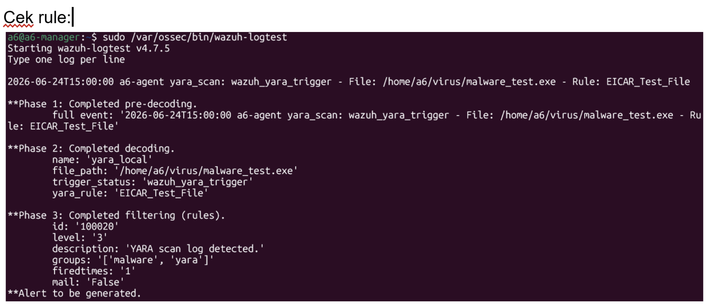

### Alur Deteksi Malware

```
File baru masuk ke /home/a6/virus/ (di Agent)
        ↓
Wazuh Syscheck mendeteksi perubahan (realtime)
        ↓
YARA scan memcocokkan signature
        ↓
Wazuh rule 100020 → 100021 trigger (level 12)
        ↓
Alert JSON dikirim ke Shuffle SOAR via Webhook
        ↓
Shuffle menjalankan workflow respons (notifikasi)
```

### Output

- ✅ YARA berhasil mendeteksi file EICAR test sebagai malware
- ✅ Wazuh `logtest` mengkonfirmasi rule `100020` terpicu dengan benar
- ✅ Integration dengan Shuffle berhasil (rule ID `100021` ditambahkan ke webhook)
- ✅ Monitoring realtime berjalan pada direktori `/home/a6/virus/`

---

## 🟡 Use Case 3: Phishing Email Detection & AI Classification

### Latar Belakang

Serangan **phishing** melalui email adalah vektor serangan paling umum dan paling berhasil dalam social engineering. Menurut berbagai laporan, lebih dari 90% serangan siber dimulai dari email phishing. Deteksi manual oleh pengguna tidak reliable karena teknik phishing semakin canggih. Oleh karena itu, kami mengembangkan sistem deteksi phishing otomatis menggunakan **Deep Learning** yang diintegrasikan ke dalam workflow SOAR.

### AI Model yang Digunakan

| Aspek | Detail |
|-------|--------|
| **Arsitektur** | Deep Learning (Neural Network) dengan Embedding Layer |
| **Format Training** | Keras (`.keras`) — 32 MB |
| **Format Deploy** | ONNX (`.onnx`) — 10.6 MB |
| **Dataset** | [Enron Spam Subset dari Kaggle](https://www.kaggle.com/code/madhusudanhasbe/phishing-safe-classification/notebook) — 252,259 email berlabel |
| **Tokenizer** | Keras Tokenizer (disimpan sebagai `tokenizer.pkl` + `tokenizer_word_index.json`) |
| **Max Sequence Length** | 300 token |
| **Max Words** | 10,000 (vocab size) |
| **Output** | Binary classification: `is_phishing: true/false` + `confidence_score` |

- **Training Notebook:** [`Phissing/phissing.ipynb`](Phissing/phissing.ipynb)
- **Test Script (API Endpoint):** [`Phissing/test_phissing_onnx.py`](Phissing/test_phissing_onnx.py)

#### Preprocessing Pipeline

```python
def clean_text(text):
    text = text.lower()
    text = re.sub(r'http\S+|www\S+', '', text)   # Hapus URL
    text = re.sub(r'\S+@\S+', '', text)           # Hapus email address
    text = re.sub(r'[^a-z\s]', '', text)          # Hapus non-huruf
    text = re.sub(r'\s+', ' ', text).strip()      # Normalisasi spasi
    return text
```

#### Endpoint API (Hosted di VM Azure)

Model di-deploy sebagai REST API di `http://172.197.203.118:8000/predict` yang menerima body:
```json
{
  "text": "<isi email>"
}
```

Dan mengembalikan response:
```json
{
  "ok": true,
  "is_phishing": false,
  "label": "Safe / false Alarm",
  "confidence_score": 99.58,
  "raw_score": 0.004201322793960571,
  "text_received": "<isi email>"
}
```

### Workflow SOAR (Shuffle) — Phishing Detection

#### Alur Lengkap

```
Scheduler (Cron: */10 * * * *) — Setiap 10 menit
        ↓
Gmail-list: GET mail users messages list (query: is:unread -label:AI-Processed)
        ↓
Gmail-read: GET mail users messages get (loop per message ID)
        ↓
Send to AI: POST body.snippet ke http://172.197.203.118:8000/predict
        ↓
┌─── Condition: $send_to_ai.body.is_phishing == true ───┐
│                                                         │
▼                                                         ▼
Add AI label                                    SoC Alerta Phishing
(Gmail POST: addLabelIds "AI-Processed")        (Telegram Send Message)
```

#### Workflow Akhir

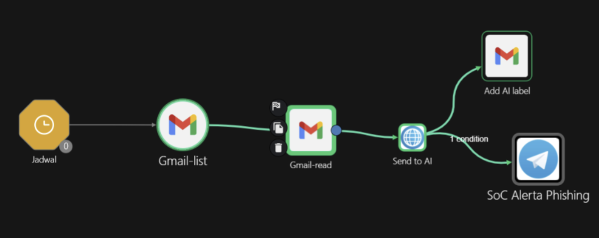

#### STEP 1 — Buat OAuth 2.0 Client di Google Cloud Console

Buat OAuth 2.0 Client untuk mengakses Gmail API melalui Shuffle. App dibuat dengan status **In Production** dan tipe **External**.

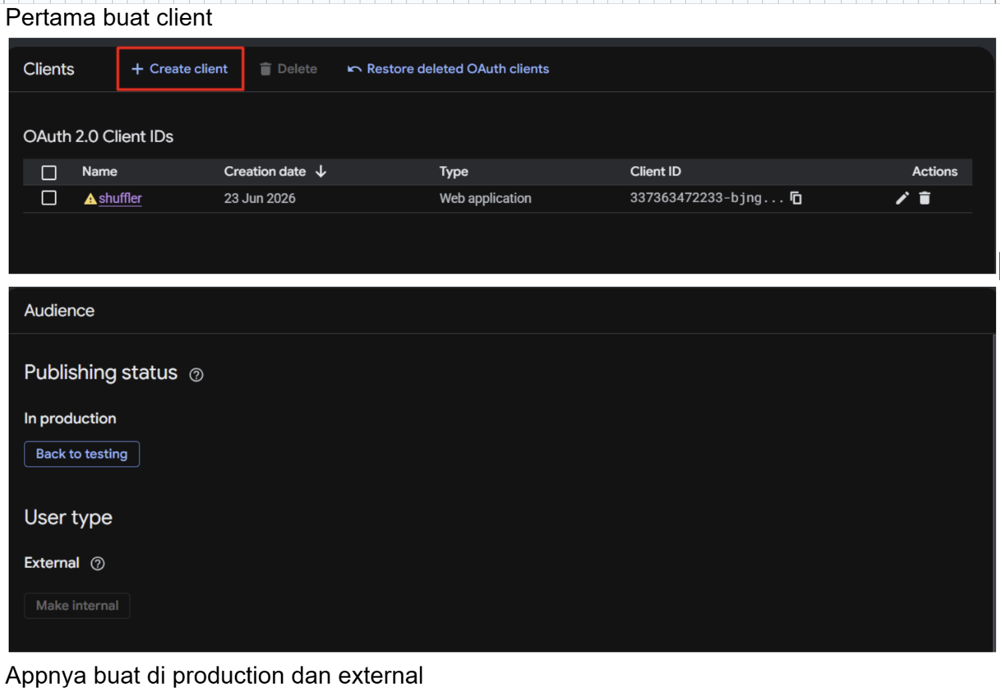

#### STEP 2 — Konfigurasi Redirect URI & Client Secret

Tambahkan **Authorized Redirect URIs** milik Shuffle agar bisa diakses:
- `https://shuffler.io/oauth2/callback`
- `https://shuffler.io/set_authentication`

Catat **Client ID** dan **Client Secret** untuk dimasukkan ke Shuffle.

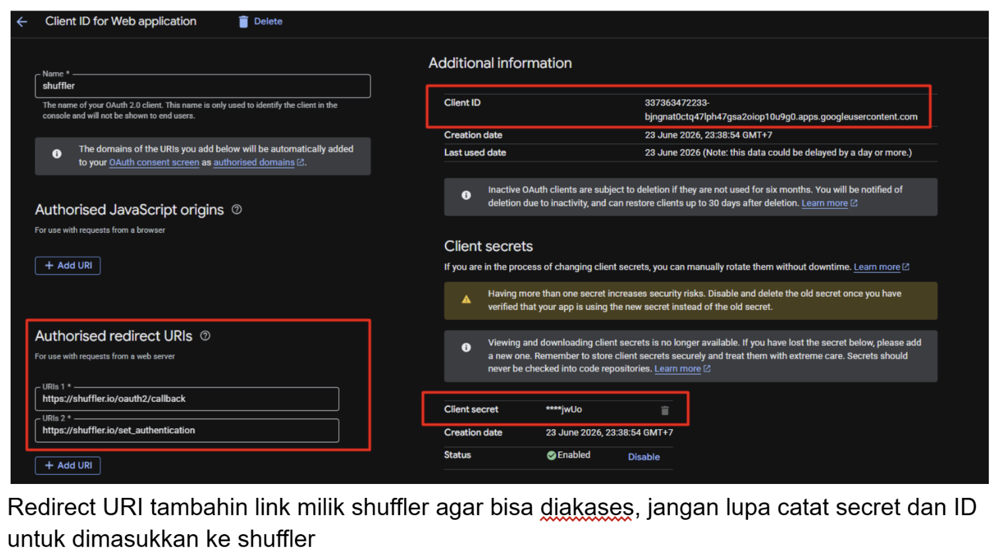

#### STEP 3 — Autentikasi di Shuffle

Masukkan Client ID, Client Secret, dan URL `https://gmail.googleapis.com` ke konfigurasi autentikasi Shuffle. Pastikan scope yang diberikan sesuai:
- `https://www.googleapis.com/auth/gmail.readonly`
- `https://www.googleapis.com/auth/gmail.modify`
- `https://www.googleapis.com/auth/gmail.send`

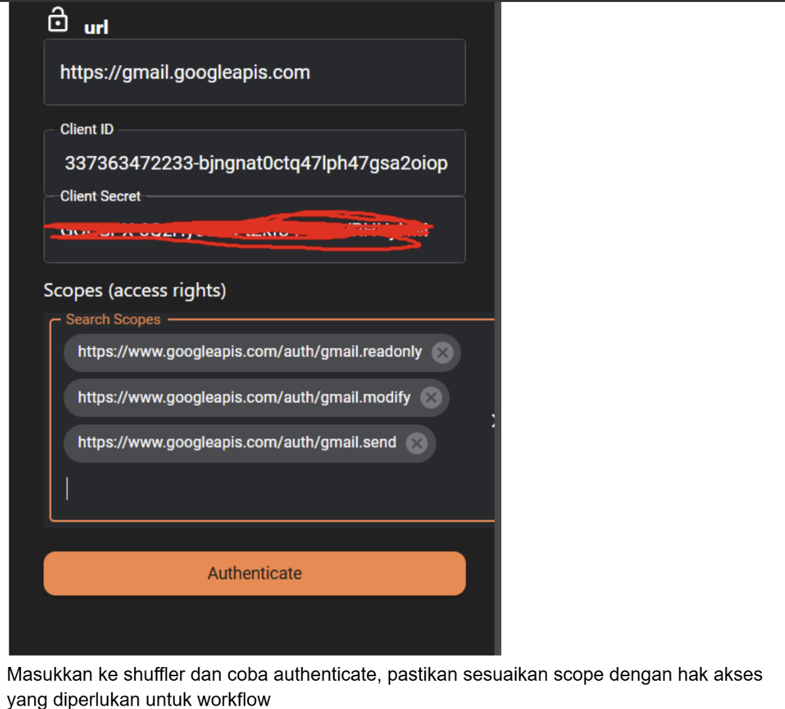

#### STEP 4 — Node Gmail-list (List Unread Messages)

Node pertama menggunakan action **GET mail users messages list** dengan `UserId: me` dan query `is:unread -label:AI-Processed` untuk mengambil daftar email yang belum dibaca dan belum diproses oleh AI.

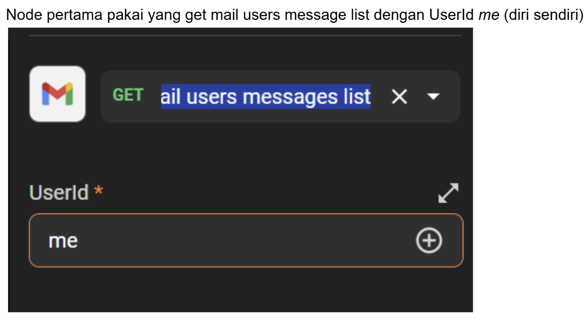

#### STEP 5 — Node Gmail-read (Read Message Content)

Hasil list message dilempar ke node selanjutnya untuk membaca isi email. ID message diambil dari `$gmail-list.body.messages.#.id`.

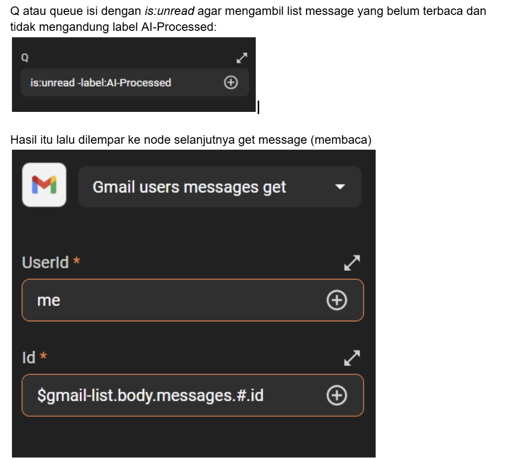

#### STEP 6 — Node Send to AI (Phishing Classification)

Body email (snippet) dikirim ke endpoint VM yang meng-hosting AI Model Phishing via **HTTP POST** ke `http://172.197.203.118:8000/predict`:

```json
{
  "text": "$exec.body.snippet"
}
```

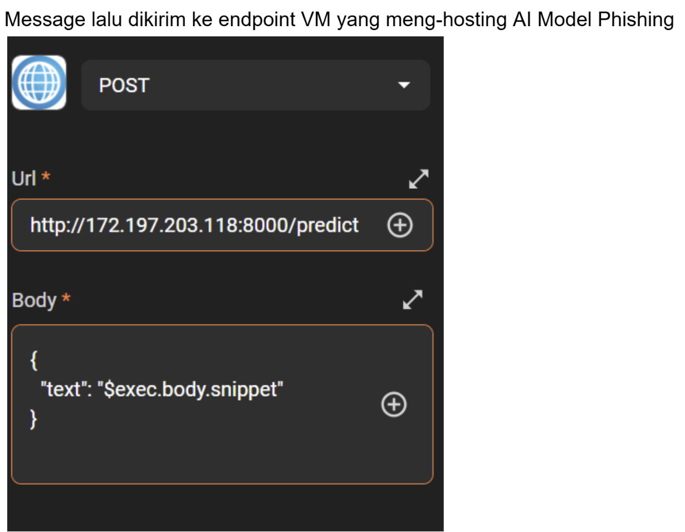

#### STEP 7 — Setup Label "AI-Processed"

Sebelum menambahkan node labeling, buat dulu label baru **"AI-Processed"** di Gmail untuk menandai email yang sudah diproses agar tidak diproses ulang.

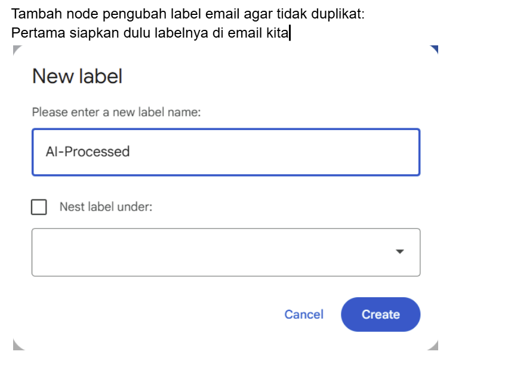

#### STEP 8 — Node Add AI Label

Setelah email diproses oleh AI, tambahkan label **"AI-Processed"** menggunakan Gmail API `POST Gmail users messages modify`:

```json
{
  "addLabelIds": ["AI-Processed"],
  "removeLabelIds": []
}
```

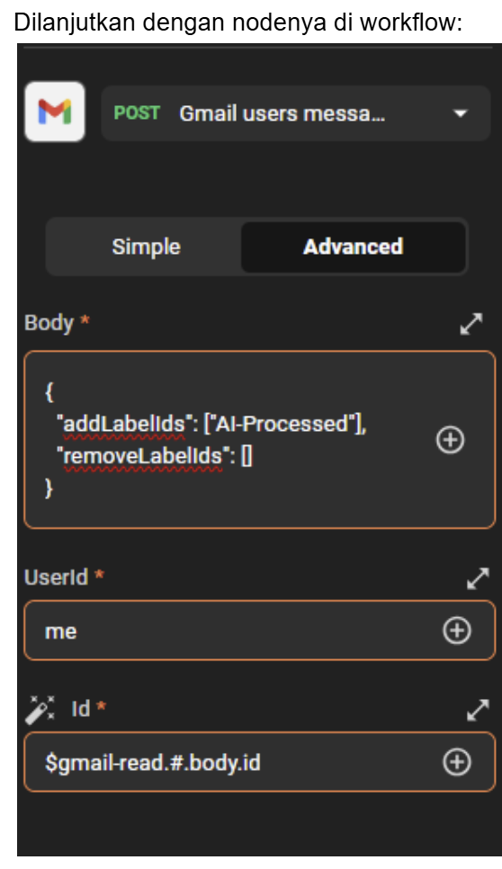

#### STEP 9 — Condition: Telegram Notification

Telegram node hanya mengirim notifikasi **jika AI mendeteksi phishing** (`$send_to_ai.body.is_phishing == true`):

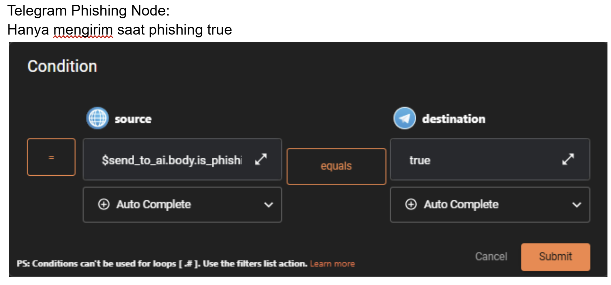

Isi pesan alert yang dikirim ke Telegram:

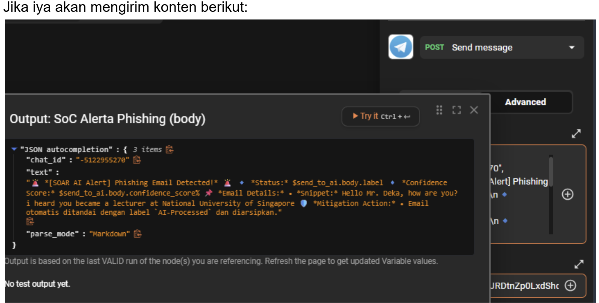

#### STEP 10 — Scheduler (Automasi)

Workflow dijalankan secara otomatis menggunakan **Scheduler** dengan cron `*/10 * * * *` (setiap 10 menit) di environment **cloud**:


### Output & Hasil Workflow

#### Hasil List Message Unread

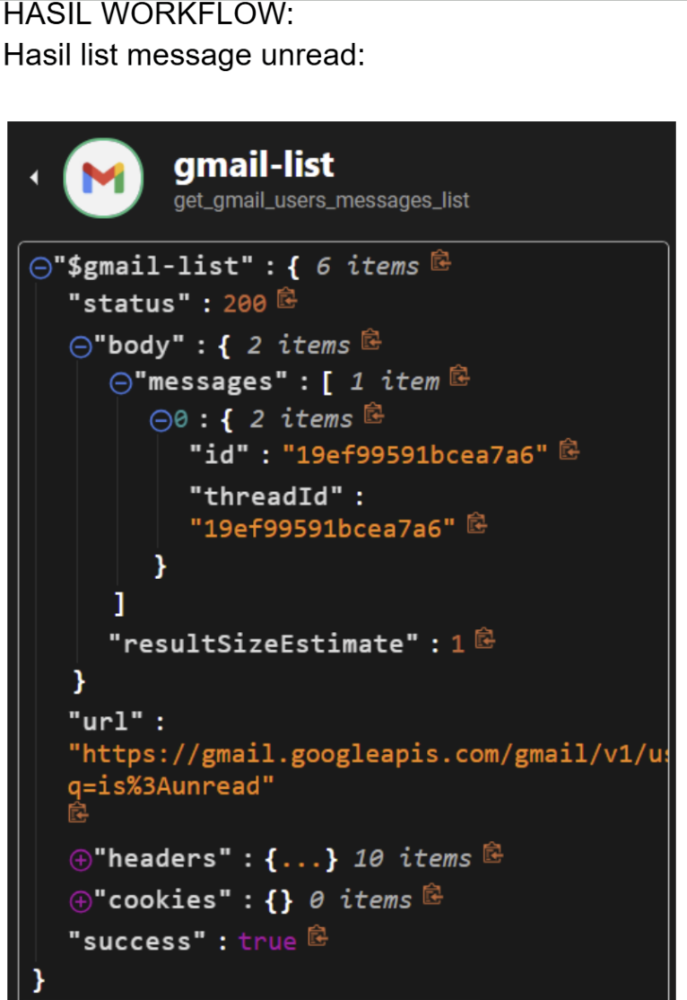

#### Hasil Read Message

Snippet email berhasil dibaca: *"Hello Mr. Deka, how are you? i heard you became a lecturer at National University of Singapore"*

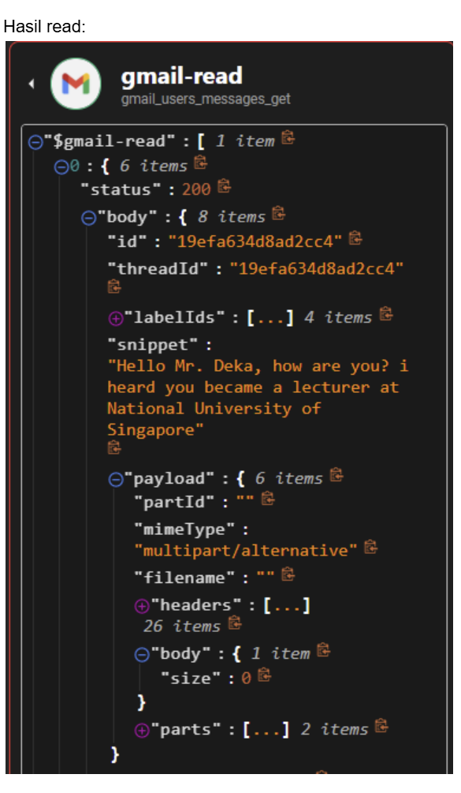

#### Hasil Klasifikasi AI

AI Model berhasil mengklasifikasikan email di atas sebagai **Safe / false Alarm** dengan **confidence score 99.58%** dan raw score `0.0042`:

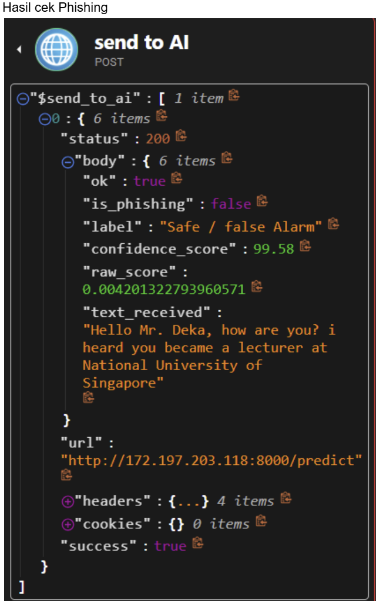

#### Hasil Labeling Email

Email yang telah diproses berhasil diberi label **"AI-Processed"** di Gmail:

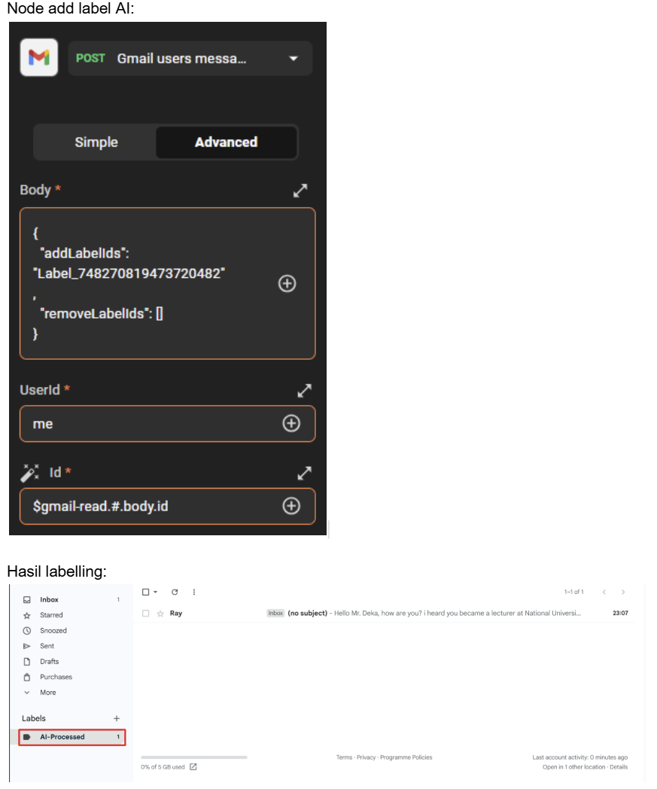

---

## 📊 Ringkasan Hasil & Dampak

### Hasil yang Dicapai

| Use Case | Komponen | Status | Bukti |
|----------|----------|--------|-------|
| **DDoS** | hping3 SYN Flood | ✅ | 3000 SYN packets terkirim |
| **DDoS** | Wazuh rule 100011 | ✅ | Alert level 12 di dashboard |
| **DDoS** | AI Classification | ✅ | Model CNN/DNN/GRU/LSTM terdeploy |
| **DDoS** | Global IP Block | ✅ | AR command sent to all agents |
| **DDoS** | Notion Logging | ✅ | Kanban board terupdate otomatis |
| **DDoS** | Telegram Alert | ✅ | Notifikasi real-time ke grup SOC |
| **Malware** | YARA Rule (EICAR) | ✅ | Signature match di logtest |
| **Malware** | Wazuh Syscheck | ✅ | Realtime monitoring `/home/a6/virus/` |
| **Malware** | Integration webhook | ✅ | Rule 100021 terpicu dan terkirim |
| **Phishing** | Gmail API Integration | ✅ | OAuth 2.0 + list/read messages |
| **Phishing** | AI Classification (ONNX) | ✅ | Confidence 99.58% pada email safe |
| **Phishing** | Auto-Labeling | ✅ | Label "AI-Processed" ditambahkan |
| **Phishing** | Scheduler | ✅ | Cron */10 berjalan otomatis |
| **Phishing** | Telegram Alert | ✅ | Condition-based notification |

### Dampak Arsitektur Human-AI Collaboration

1. **Reduksi False Positive** — AI menyaring alert sebelum SOAR bertindak, hanya ancaman valid yang ditindaklanjuti
2. **Respon Lebih Cepat** — Otomasi dari deteksi hingga mitigasi dalam hitungan detik
3. **Mengurangi Alert Fatigue** — Analis SOC hanya menerima notifikasi untuk ancaman terverifikasi
4. **Skalabilitas** — Arsitektur modular memungkinkan penambahan use case baru tanpa mengubah pipeline inti
5. **Audit Trail** — Setiap insiden tercatat di Notion Database untuk keperluan investigasi dan pelaporan

---

## 📚 Referensi & Dataset

### Dataset

| Use Case | Dataset | Sumber |
|----------|---------|--------|
| DDoS | DDoS Network Traffic | [Kaggle - DDoSS](https://www.kaggle.com/code/habibiziddanmuhammad/ddoss) |
| Phishing | Enron Spam Subset (252,259 email) | [Kaggle - Phishing Safe Classification](https://www.kaggle.com/code/madhusudanhasbe/phishing-safe-classification/notebook) |

### Referensi Teknis

- [Dokumentasi Wazuh API](https://documentation.wazuh.com/current/user-manual/api/index.html)
- [Wazuh YARA Integration](https://documentation.wazuh.com/current/proof-of-concept-guide/detect-malware-yara-integration.html)
- [Shuffle SOAR Documentation](https://shuffler.io/docs/about)
- [ONNX Runtime Documentation](https://onnxruntime.ai/docs/)
- [Gmail API Reference](https://developers.google.com/gmail/api/reference/rest)

---
